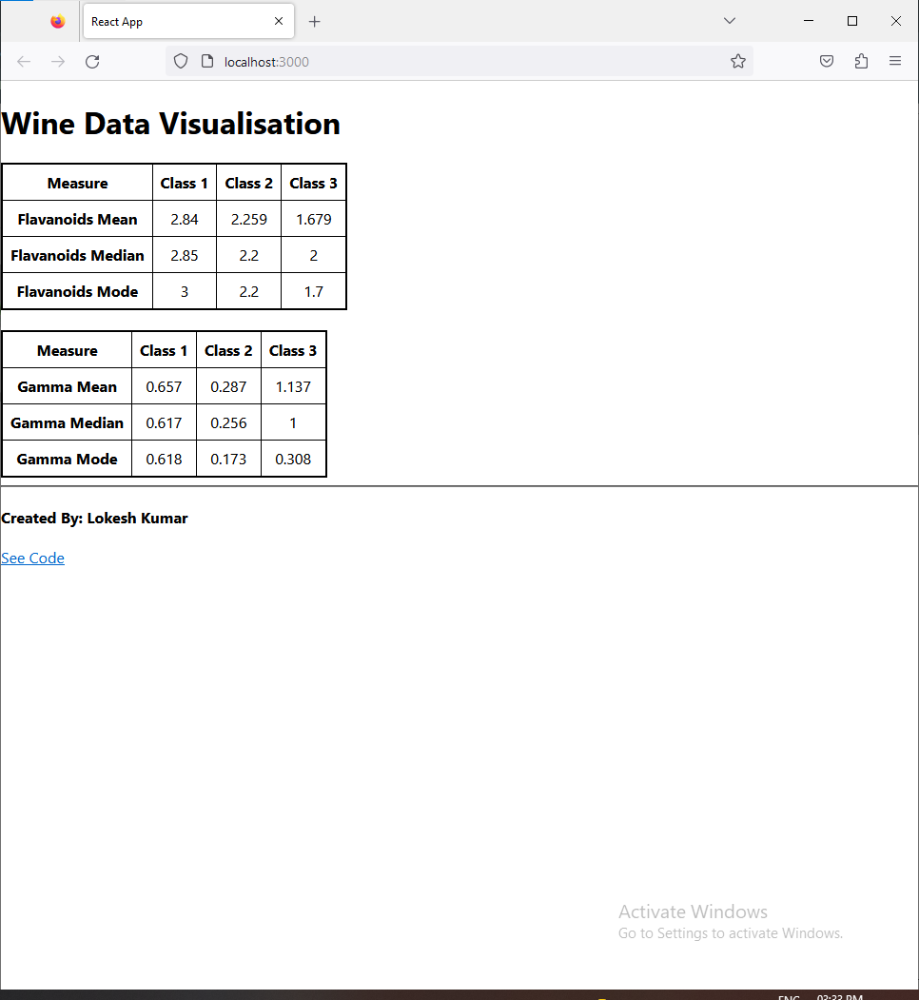

## Hi Peeps @ Manufac Analytics!
## Lets get started with Wine Data Visualisation 

# Screenshot 

# Running the Project
1. Clone the Repository -> Run the below command in cmd/terminal in a new directory
### `git clone https://github.com/Neolokeshkr/ManufacAnalytics-DataVisualisationChallange.git`

2. Navigate to Project Directory
### `cd ManufacAnalytics-DataVisualisationChallange/`

3. Install Dependencies:
### `yarn install`

4. Start the application:
### `yarn start`

5.  Run the app in the development mode.\
    Open [http://localhost:3000](http://localhost:3000) to view it in your browser.

7. ### `Enjoy!`

